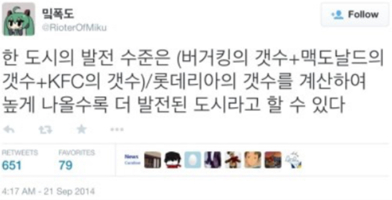

도심지나 번화가에 주로 위치한 버거킹, 맥도날드, KFC의 점포 수를 전국 어디에나 분포한 롯데리아의 점포 수로 나누면 한 도시의 발전 수준이 나온다는 2014년의 트윗에서 시작해, 여러 데이터 분석가 분들께서 다양한 자료를 만들어주셨습니다.

흔히 알려진 지도는 2020년, 그로부터 지금까지 행정구역의 변화도 생기고 또 다양한 프랜차이즈가 나타났습니다. 그래서 다시 만들어보자 생각했습니다.

2025년에 맞게, 맘스터치와 써브웨이를 더하고, 사용자가 직접 계산 요소를 덧붙이거나 제외하여 데이터를 분석할 수 있는 버거지수 지도를 제작했습니다

사용법은 간단합니다.
1. 계산에 포함시킬 프랜차이즈를 선택하여 주십시오.
2. 선택한 항목을 포함하여 계산된 값은 아래 표의 '비율'에 표시됩니다.
3. 계산된 값에 따라 좌측 지도의 색이 바뀝니다.

사이트 내 정보 오류, 수정 요청이나 버그 제보는 Github Issue 또는 이메일(admin at ssogari dot dev)로 보내주시면 조치하겠습니다.

이 사이트의 데이터베이스를 수집하는 데 사용된 크롤링 도구와 웹 사이트 코드는 Github에서 확인하실 수 있습니다. Claude 3 Opus와 Claude 3.5 Sonnet의 도움을 받아 사이트를 제작하였습니다.
